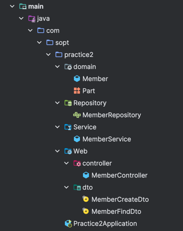

# 📄 Work Description

##  🍊 등록한 모든 멤버가 List로 반환되는 API 구현하기 🍊

### 📋[POST] 멤버 가입 API 구현 

- [ ] API 명세서 작성하기
- [ ] 새로 가입하는 유저의 정보가 담긴 DTO 생성하기
- [ ] MemberController 작성하기
- [ ] DTO를 가지고 MemberService 클래스에서 비지니스 로직을 통해 엔티티 객체를 생성하기
- [ ] 생성된 객체를 기반으로 MemberRepository를 호출하여 데이터베이스에 반영하기
- [ ] Postman으로 API 테스트 하기

### 📁[GET] 멤버 조회 API 구현

- [ ] API 명세서 작성하기
- [ ] MemberController에 memberId 받아오기
- [ ] 멤버 정보를 넘겨줄 DTO 생성하기(정적 팩토리 메서드로 구현)
- [ ] 받아온 Id를 기준으로 Member를 찾아 MemberFindDto를 만드는 메서드 구현하기
- [ ] Id를 찾을 수 없는 경우 오류 출력하기
- [ ] Postman으로 API 테스트 하기

### 🗞️[DELETE] 멤버 삭제 API 구현

- [ ] API 명세서 작성하기
- [ ] MemberController에서 요청 처리하기(PathVariable 받아오기)
- [ ] MemberService에서 받아온 id에 해당하는 Member 엔티티를 삭제하는 로직을 작성하기
- [ ] Postman으로 API 테스트 하기

### 🗂️[GET] 멤버 리스트 조회 API 구현

- [ ] API 명세서 작성하기
- [ ] MemberService 클래스에 모든 멤버를 조회하는 메소드를 추가하기
- [ ] MemberRepository의 findAll을 사용하여 모든 멤버 데이터를 가져오기
- [ ] MemberController 클래스에 새로운 GET 요청 매핑을 추가하여 모든 멤버를 반환하는 API 엔드포인트를 생성하기
- [ ] Postman으로 API 테스트 하기

# ⚙️ ISSUE
- closed #5

## 🧾 API 명세서

### [POST] 멤버 가입
<h3><strong>1️⃣ 어떤 API 인가요?</strong></h3>
<p> [POST] 멤버 가입 API</p>
<p>사용자의 정보를 받아서 Member 객체 생성 후 DB에 저장</p>
<h3><strong>2️⃣ Request</strong></h3>
<p><strong>Path Parameter</strong></p>
<p><strong>Request Header</strong></p>
<p>[POST] <a href="http://localhost:8080/api/v1/member">http://localhost:8080/api/v1/member</a></p>
<p><strong>Request Body</strong></p>

이름 | 타입 | Description
-- | -- | --
name | String | 이름
part | String | 소속 파트
age | int | 나이
```json
{
    "name" : "정정교",
    "part" : "SERVER",
    "age" : 27
}
```
### 3️⃣Response

**✨Response Body**

status | 201 Created
-- | --


<pre><code class="language-json">{           
}
</code></pre>

---

### [GET] 멤버 조회

<h3><strong>1️⃣어떤 API 인가요?</strong></h3>
<p>[GET] 멤버 조회 API</p>
<p>memberId를 Path variables로 받아 해당하는 멤버 정보를 반환하는 API</p>
<h3><strong>2️⃣Request</strong></h3>
<p><strong>Path Parameter</strong></p>

Key | Value | Description
-- | -- | --
memberId | int | 멤버 id

**Request Header**

[GET] http://localhost:8080/api/v1/member/:memberId

**Request Body**

### 3️⃣Response

**✨Response Body**

status | 200 OK
-- | --

이름 | 타입 | Description
-- | -- | --
name | String | 이름
part | String | 소속 파트
age | int | 나이


<pre><code class="language-json">{
    &quot;name&quot;: &quot;정정교&quot;,
    &quot;part&quot;: &quot;SERVER&quot;,
    &quot;age&quot;: 27
}
</code></pre>

---

### [DELETE] 멤버 삭제

<h3><strong>1️⃣ 어떤 API 인가요?</strong></h3>
<p>[DELETE] 멤버 삭제 API</p>
<p>memberId를 Path variables로 받아 해당하는 멤버 정보를 DB에서 삭제하는 API</p>
<h3><strong>2️⃣ Request</strong></h3>
<p><strong> Path Parameter</strong></p>

Key | Value | Description
-- | -- | --
memberId | int | 멤버 id

**Request Header**

[DELETE] http://localhost:8080/api/v1/member/:memberId

**Request Body**

### 3️⃣ Response
**✨Response Body**

status | 204 No Content
-- | --

<pre><code class="language-json">{           
}
</code></pre>

---

### [GET] 멤버 리스트 조회

<h3><strong>1️⃣ 어떤 API 인가요?</strong></h3>
<p>[GET] 멤버 리스트 조회 API </p>
<p>등록한 모든 멤버가 List로 반환되는 API</p>
<h3><strong>2️⃣ Request</strong></h3>
<p><strong> Path Parameter</strong></p>

Key | Value | Description
-- | -- | --
memberId | int | 멤버 id

**Request Header**

[GET] http://localhost:8080/api/v1/member/find-all

**Request Body**

### 3️⃣ Response

**✨Response Body**

status | 200 OK
-- | --


이름 | 타입 | Description
-- | -- | --
name | String | 이름
part | String | 소속 파트
age | int | 나이

<pre><code class="language-json">[
    {
        &quot;name&quot;: &quot;이름1&quot;,
        &quot;part&quot;: &quot;SERVER&quot;,
        &quot;age&quot;: 24
    },
    {
        &quot;name&quot;: &quot;이름2&quot;,
        &quot;part&quot;: &quot;PLAN&quot;,
        &quot;age&quot;: 25
    },
    {
        &quot;name&quot;: &quot;이름3&quot;,
        &quot;part&quot;: &quot;DESIGN&quot;,
        &quot;age&quot;: 26
    },
    {
        &quot;name&quot;: &quot;이름4&quot;,
        &quot;part&quot;: &quot;WEB&quot;,
        &quot;age&quot;: 27
    },
    {
        &quot;name&quot;: &quot;이름5&quot;,
        &quot;part&quot;: &quot;ANDROID&quot;,
        &quot;age&quot;: 28
    },
    {
        &quot;name&quot;: &quot;이름6&quot;,
        &quot;part&quot;: &quot;IOS&quot;,
        &quot;age&quot;: 29
    }
]
</code></pre>
<!-- notionvc: c6d790e7-b145-4d5e-a050-3aed1b8ab53e -->

---
# 📷 Screenshot

## 클래스 구조


## dto
### MemberCreateDto
```java
package com.sopt.practice2.Web.dto;

import com.sopt.practice2.domain.Part;

public record MemberCreateDto(String name, Part part, int age) {
}
```
### MemberFindDto
```java
package com.sopt.practice2.Web.dto;

import com.sopt.practice2.domain.Member;
import com.sopt.practice2.domain.Part;

public record MemberFindDto(
        String name,
        Part part,
        int age
) {
    public static MemberFindDto of(
            Member member
    ){
        return new MemberFindDto(member.getName(), member.getPart(), member.getAge());
    }
}
```
## service
### MemberService
```java
package com.sopt.practice2.Service;

import com.sopt.practice2.Repository.MemberRepository;
import com.sopt.practice2.Web.dto.MemberCreateDto;
import com.sopt.practice2.Web.dto.MemberFindDto;
import com.sopt.practice2.domain.Member;
import jakarta.persistence.EntityNotFoundException;
import lombok.RequiredArgsConstructor;
import org.springframework.stereotype.Service;
import org.springframework.transaction.annotation.Transactional;

import java.util.List;
import java.util.stream.Collectors;

@Service
@RequiredArgsConstructor
public class MemberService {
    private final MemberRepository memberRepository;

    @Transactional
    public String createMember(
            MemberCreateDto memberCreateDto
    ) {
        Member member = Member.builder()
                .name(memberCreateDto.name())
                .part(memberCreateDto.part())
                .age(memberCreateDto.age())
                .build();
        memberRepository.save(member);
        return member.getId().toString();
    }

    public MemberFindDto findMemberById(
            Long memberId
    ){
        return MemberFindDto.of(memberRepository.findById(memberId).orElseThrow(
                () -> new EntityNotFoundException("ID에 해당하는 사용자가 존재하지 않습니다.")
        ));
    }

    public void deleteMemberById(
            Long memberId
    ){
        memberRepository.findById(memberId).orElseThrow(
                () -> new EntityNotFoundException("ID에 해당하는 사용자가 존재하지 않습니다.")
        );
        memberRepository.deleteById(memberId);
    }

    // 멤버 리스트 모든 멤버를 조회하는 메서드 추가하기
    public List<MemberFindDto> findAllMembers() {
        return memberRepository.findAll().stream()
                .map(member -> new MemberFindDto(member.getName(), member.getPart(), member.getAge()))
                .collect(Collectors.toList());
    }
}
```
## controller
### MemberController
```java
package com.sopt.practice2.Web.controller;

import com.sopt.practice2.Service.MemberService;
import com.sopt.practice2.Web.dto.MemberCreateDto;
import com.sopt.practice2.Web.dto.MemberFindDto;
import lombok.RequiredArgsConstructor;
import org.apache.coyote.Response;
import org.springframework.http.ResponseEntity;
import org.springframework.web.bind.annotation.*;

import java.net.URI;
import java.util.List;

@RestController // @Controller + @ResponseBody : java 객체로 반환되는 값을 JSON으로 변환하여 리턴
@RequiredArgsConstructor // DI를 위해 사용, final 필드 + @NonNull이 붙은 필드에 대해 생성자 생성
@RequestMapping("/api/v1/member")
public class MemberController {
    private final MemberService memberService;

    @PostMapping
    public ResponseEntity createMember(
            @RequestBody MemberCreateDto memberCreateDto // DTO 데이터를 자바 객체로 변환하여 받아온다.
    ){
        return ResponseEntity.created(URI.create(memberService.createMember(memberCreateDto))).build();
    }

    @GetMapping("/{memberId}")
    public ResponseEntity<MemberFindDto> findMemberById(
            @PathVariable Long memberId
    ){
        return ResponseEntity.ok(memberService.findMemberById(memberId));
    }

    @DeleteMapping("/{memberId}")
    public void deleteMemberById(
            @PathVariable Long memberId
    ){
        memberService.deleteMemberById(memberId);
    }

    // 실습 : 모든 멤버리스트를 반환하는 API 추가
    @GetMapping("/find-all")
    public ResponseEntity<List<MemberFindDto>> findAllMembers() {
        List<MemberFindDto> members = memberService.findAllMembers();
        return ResponseEntity.ok(members);
    }
}
```
## main
```java
package com.sopt.practice2;

import org.springframework.boot.SpringApplication;
import org.springframework.boot.autoconfigure.SpringBootApplication;

@SpringBootApplication
public class Practice2Application {

    public static void main(String[] args) {
        SpringApplication.run(Practice2Application.class, args);
    }
}
```
# 💬 To Reviewers
- 생각보다 단계적으로 구현을 해보려고 하니 효율적인 코드에 대해 많이 고민하게 되는 것 같습니다. 최대한 SOLID 법칙을 지키기 위해서 메서드들을 분리해보려고 했는데, 쉽지가 않네요 ㅎㅎ;; 이후에 고객 테이블을 추가해서 각자 비밀번호를 설정하고, 계좌를 이체하기 전 비밀번호를 입력하도록 하는 기능들도 추가해보려고 생각중입니다! 부족하지만 더 효율적인 코드방향성이 있다면 말씀해주시면 감사드리겠습니다 👍 